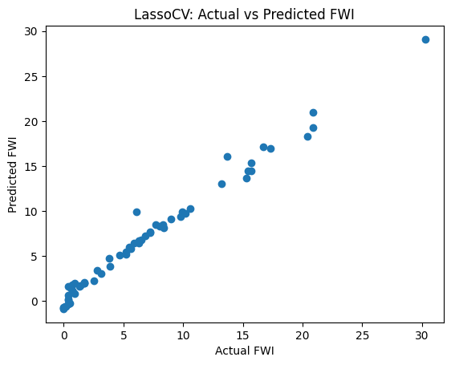

# 🔥 Algerian Forest Fire Prediction - EDA & Machine Learning


## 📋 Project Overview

This project analyzes and predicts forest fires in Algeria using machine learning techniques. The dataset includes 244 instances from two regions of Algeria (Bejaia and Sidi Bel-abbes) covering the period from June 2012 to September 2012.

### 🎯 Objectives
- **Data Cleaning & Preprocessing**: Handle missing values, encode categorical variables, and prepare data for analysis
- **Exploratory Data Analysis (EDA)**: Understand patterns, correlations, and distributions in forest fire data
- **Feature Engineering**: Select relevant features and handle multicollinearity
- **Machine Learning**: Build and evaluate regression models to predict Fire Weather Index (FWI)
- **Model Comparison**: Compare Linear, Lasso, Ridge, and ElasticNet regression models

## 📊 Dataset Information

### Dataset Details
- **Total Instances**: 244 (122 per region)
- **Features**: 11 attributes + 1 output attribute
- **Time Period**: June 2012 - September 2012
- **Regions**: 
  - Bejaia (Northeast Algeria) - Region 0
  - Sidi Bel-abbes (Northwest Algeria) - Region 1
- **Target Classes**: Fire (138 instances) and Not Fire (106 instances)

### Features Description
| Feature | Description | Range |
|---------|-------------|-------|
| **Date** | Day/Month/Year | June-September 2012 |
| **Temperature** | Noon temperature (°C) | 22-42 |
| **RH** | Relative Humidity (%) | 21-90 |
| **Ws** | Wind Speed (km/h) | 6-29 |
| **Rain** | Total daily rainfall (mm) | 0-16.8 |
| **FFMC** | Fine Fuel Moisture Code | 28.6-92.5 |
| **DMC** | Duff Moisture Code | 1.1-65.9 |
| **DC** | Drought Code | 7-220.4 |
| **ISI** | Initial Spread Index | 0-18.5 |
| **BUI** | Buildup Index | 1.1-68 |
| **FWI** | Fire Weather Index | 0-31.1 |
| **Classes** | Fire occurrence (Fire/Not Fire) | Binary |

## 🔄 Project Workflow

### Phase 1: Data Cleaning & Exploratory Data Analysis
[](phase01-data-cleaning-eda.ipynb)

**Key Steps:**
1. **Data Loading & Initial Inspection**
   - Load dataset with proper headers
   - Check data types and missing values
   - Basic statistical summary

2. **Data Cleaning**
   - Add Region column for geographical distinction
   - Remove rows with missing values
   - Clean column names (remove whitespace)
   - Convert data types (integers and floats)

3. **Exploratory Data Analysis**
   - Target variable distribution analysis
   - Feature correlation analysis
   - Outlier detection using box plots
   - Regional fire pattern analysis

4. **Visualizations Generated**
   - Distribution histograms for all features
   - Correlation heatmap
   - Class distribution pie chart
   - Monthly fire analysis by region
   - Box plots for outlier detection

### Phase 2: Model Training & Evaluation
[](phase02-model-training.ipynb)

**Key Steps:**
1. **Feature Engineering**
   - Remove temporal features (day, month, year)
   - Encode target variable
   - Handle multicollinearity (correlation > 0.85)

2. **Data Preparation**
   - Train-test split (75-25)
   - Feature scaling using StandardScaler
   - Visualization of scaling effects

3. **Model Training & Evaluation**
   - Linear Regression (baseline)
   - Lasso Regression + LassoCV
   - Ridge Regression + RidgeCV
   - ElasticNet + ElasticNetCV
   - Cross-validation for hyperparameter tuning

4. **Performance Metrics**
   - Mean Absolute Error (MAE)
   - R² Score
   - Actual vs Predicted scatter plots

## 📸 Visual Results

### Phase 1: EDA Visualizations

| Visualization | Description |
|---------------|-------------|
|  | **Correlation Analysis**: Feature relationships and multicollinearity detection |
|  | **Feature Distributions**: Histogram plots showing data distribution patterns |
|  | **Bejaia Region**: Monthly fire occurrence patterns in Northeast Algeria |
|  | **Sidi-Bel Abbes Region**: Monthly fire patterns in Northwest Algeria |
|  | **Target Distribution**: Fire vs Non-Fire class balance visualization |

### Phase 2: Model Performance

| Model | Visualization | Performance |
|-------|---------------|-------------|
| **Correlation Analysis** |  | Feature correlation after preprocessing |
| **Data Scaling** |  | Before/After standardization comparison |
| **Linear Regression** |  | Baseline model performance |
| **Lasso Regression** |  | L1 regularization results |
| **LassoCV** |  | Cross-validated Lasso performance |
| **Ridge Regression** |  | L2 regularization results |
| **RidgeCV** |  | Cross-validated Ridge performance |
| **ElasticNet** |  | Combined L1+L2 regularization |
| **ElasticNetCV** |  | Optimized ElasticNet performance |

## 🚀 Getting Started

### Prerequisites
```bash
Python 3.8+
Jupyter Notebook
Git
```

### Required Libraries
```bash
pandas>=1.3.0
numpy>=1.21.0
matplotlib>=3.4.0
seaborn>=0.11.0
scikit-learn>=1.0.0
```

### Installation & Setup

1. **Clone the Repository**
   ```bash
   git clone https://github.com/SurajK221b/algerian-fire-forest-eda-ml.git
   cd algerian-fire-forest-eda-ml
   ```

2. **Create Virtual Environment** (Recommended)
   ```bash
   # Using conda
   conda create -n forest-fire python=3.8
   conda activate forest-fire
   
   # Using venv
   python -m venv forest-fire-env
   source forest-fire-env/bin/activate  # On Windows: forest-fire-env\Scripts\activate
   ```

3. **Install Dependencies**
   ```bash
   pip install pandas numpy matplotlib seaborn scikit-learn jupyter
   ```

4. **Launch Jupyter Notebook**
   ```bash
   jupyter notebook
   ```

5. **Run the Analysis**
   - Start with `phase01-data-cleaning-eda.ipynb` for data cleaning and EDA
   - Continue with `phase02-model-training.ipynb` for machine learning models

## 📁 Project Structure

```
algerian-fire-forest-eda-ml/
├── 📊 data/
│   ├── Algerian_forest_fires_dataset.csv          # Original dataset
│   └── Algerian_forest_fires_cleaned_dataset.csv  # Cleaned dataset
├── 📓 phase01-data-cleaning-eda.ipynb            # Phase 1: Data cleaning & EDA
├── 📓 phase02-model-training.ipynb               # Phase 2: ML model training
├── 📸 plots/                                      # Generated visualizations
│   ├── 01-phase01-corre-heatmap.png
│   ├── 02-phase01-feaurevalue-density.png
│   ├── 03-phase01-Fire Analysis of Brjaia Regions.png
│   ├── 04-phase01-Fire Analysis of Sidi- Bel Regions.png
│   ├── 05-phase01-piechart.png
│   ├── 06-phase02-corre-heatmap.png
│   ├── 07-phase02-x-train-beforafter-scalling.png
│   ├── 08-phase02-linear-regression.png
│   ├── 09-phase02-lasso-regression.png
│   ├── 10-phase02-lassocv-regression.png
│   ├── 11-phase02-ridge-regression.png
│   ├── 12-phase02-ridgecv-regression.png
│   ├── 13-phase02-elastinet-regression.png
│   └── 14-phase02-elastinetcv-regression.png
└── 📖 README.md                                   # Project documentation
```

## 📈 Key Findings

### Data Insights
- **Seasonal Patterns**: August and September showed highest fire occurrence
- **Regional Differences**: Both regions exhibit similar fire patterns with slight variations
- **Feature Correlations**: Strong correlations found between FWI components (FFMC, DMC, DC, ISI, BUI)
- **Data Quality**: High-quality dataset with minimal missing values after cleaning

### Model Performance
- **Best Performing Models**: Ridge and ElasticNet regression with cross-validation
- **Feature Importance**: Weather conditions and FWI components are strong predictors
- **Scaling Impact**: StandardScaler significantly improved model performance
- **Regularization**: L1 and L2 regularization helped prevent overfitting

## 🔮 Future Enhancements

### Potential Improvements
- **Advanced Models**: Random Forest, XGBoost, Neural Networks
- **Feature Engineering**: Create interaction features, seasonal indicators
- **Time Series Analysis**: Temporal pattern modeling
- **Geospatial Analysis**: Include geographical features
- **Real-time Prediction**: Deploy model for live fire risk assessment

### Additional Analysis
- **Classification Models**: Predict fire occurrence (binary classification)
- **Ensemble Methods**: Combine multiple models for better predictions
- **Hyperparameter Tuning**: Grid search and Bayesian optimization
- **Feature Selection**: Advanced techniques like RFE, SelectKBest

## 🤝 Contributing

Contributions are welcome! Please feel free to submit a Pull Request. For major changes, please open an issue first to discuss what you would like to change.

### How to Contribute
1. Fork the Project
2. Create your Feature Branch (`git checkout -b feature/AmazingFeature`)
3. Commit your Changes (`git commit -m 'Add some AmazingFeature'`)
4. Push to the Branch (`git push origin feature/AmazingFeature`)
5. Open a Pull Request

## 📝 License

This project is licensed under the MIT License - see the [LICENSE](LICENSE) file for details.

## 👨‍💻 Author

**SurajK221b**
- GitHub: [@SurajK221b](https://github.com/SurajK221b)
- Repository: [algerian-fire-forest-eda-ml](https://github.com/SurajK221b/algerian-fire-forest-eda-ml)

## 📚 References

- **Dataset Source**: Algerian Forest Fire Dataset (UCI ML Repository)
- **Fire Weather Index System**: Canadian Forest Service
- **Scikit-learn Documentation**: [scikit-learn.org](https://scikit-learn.org/)
- **Pandas Documentation**: [pandas.pydata.org](https://pandas.pydata.org/)

## 🏷️ Tags

`machine-learning` `data-science` `forest-fire-prediction` `regression` `eda` `python` `jupyter` `scikit-learn` `data-analysis` `environmental-science`

---

⭐ **Star this repository if you found it helpful!** ⭐

---

*Last Updated: July 2025*
